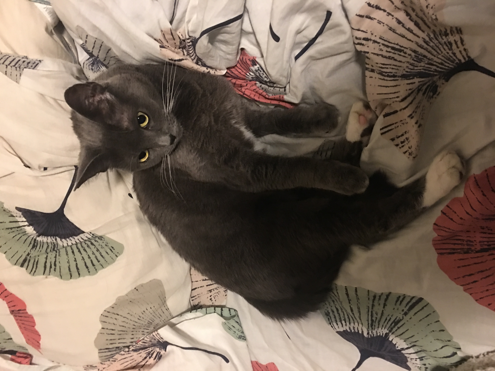

# 
 **Hannah Garcia** :cat:
##### 
 123 Portland St. Apt 0 Portland, Oregon 97979 :house:
##### 
 503-503-5033 :phone: | thisismyemail@email.com :email:
__________________________________________________________________________________

### **Education** :school:
#### Oregon State University
*Corvallis Oregon*
Bachelor of Science in Geography & Geospatial Science
Minor: Geographic Information Systems Certificate & Environmental Sciences
### **Work Experience**
#### GIS Intern, City of Portland Bureau of Transportation :bus: [PBOT Website](https://www.portlandoregon.gov/transportation/)
*Portland, Oregon*
* Digitized transportation assets from work orders and construction plans in the city’s
enterprise environments using custom ArcGIS Desktop 10.x tools
* Conducted spatial analysis to support of the bureau including:
  * Summarizing serious traffic crashes by speed limit on Portland’s high-crash corridors
  * Estimating proportion of downtowns rights-of-way dedicated to bicycle facilities
* Developed an ArcGIS Survey123 form for a city-wide curb ramp assessment
* Designed print and web maps for internal customer request
* Assisted with small group user trainings and support
#### Student Ambassador, College of Earth Ocean & Atmospheric Sciences :evergreen_tree: [CEOAS Website](http://ceoas.oregonstate.edu/)
*Corvallis Oregon*
* Represented and promoted the college at recruiting, informational and alumni events
* Shared student experience with prospective students, their families and alumni
* Answer questions about the college’s five majors and communicated opportunities
offered by the college

### Skills :computer:

ESRI | Microsoft | Coding
-----|-----------|---------
Arcmap, ArcGIS Online, Survey123 | Word, Excel, Outlook and PowerPoint | R, Markdown
 

> The study of geography is about more than just memorizing places on a map. It’s about understanding the complexity of our world, appreciating the diversity of cultures that exists across continents. And in the end, it’s about using all that knowledge to help bridge divides and bring people together.  **Barack Obama**

